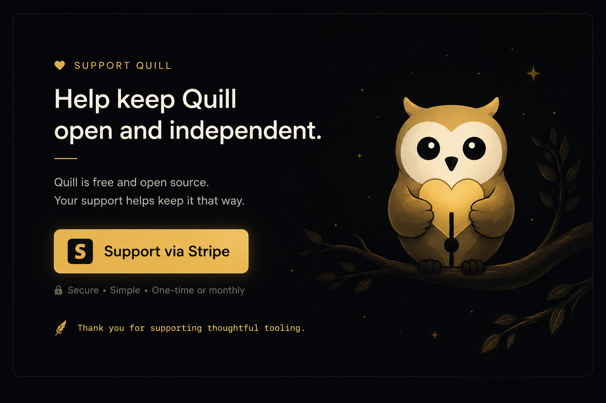

# Quill — *ask another mind.*

**Free, MIT-licensed open source. A working product *and* an active
research project on coding-agent collaboration.**

Quill mediates dialogue between the AI doing the work and a second AI
giving perspective. The headline: **if you have a Claude Pro and a Codex
Pro subscription, you have a free dual-AI coding setup.** No API key
required, no per-token cost — Quill shells out to whichever CLIs you have
installed and relays their conversation.

Built by [YG3](https://yg3.ai). See
[RESEARCH.md](RESEARCH.md) for the research direction.

Three thinking-partner skills available in any agentic CLI Quill is
installed in:

- **`consult`** — for stuck/frustrated moments. Quill's advisor reframes
  what's actually going on.
- **`perspective`** — for exploring/curious moments. Layers in a vantage
  the doer hasn't taken.
- **`assumptions`** — for "what choices is the AI making that I don't
  understand?" Translates technical assumptions into plain-language
  yes/no questions.

In Claude Code specifically, you also get safety hooks (gatekeeper for
risky shell commands) and pre-push quality scans (secrets, debug
statements, TODOs, .env files).

## The four ways to run Quill

Pick the doer (the agent in your terminal) × the advisor (who Quill
calls when you ask for perspective):

| Doer (your terminal) | Advisor (Quill calls) | Cost | Setup |
|---|---|---|---|
| **Claude Code** | **Codex CLI** | Free (Codex Pro) | `ADVISOR_BACKEND=codex_cli` |
| **Codex CLI** | **Claude CLI** | Free (Claude Pro) | `ADVISOR_BACKEND=claude_cli` |
| Claude Code | API (Elysia, OpenAI, OpenRouter, Ollama, etc.) | Per-token | `ADVISOR_BACKEND=api` |
| Codex CLI / Cursor / Cline / Continue | API or any CLI | Varies | Same |

The two highlighted rows are the headline: **two coding agents in
deliberate dialogue, billed against subscriptions you already have.**

## Install

### Prerequisites

You'll need:

- **Python 3.10+** and `git`
- **Claude Code** (if using the plugin path), OR **any MCP-aware agent**
  (Codex CLI, Cursor, Cline, Continue) for the MCP path
- **A logged-in advisor CLI** matching whichever backend you'll
  configure:
  - `codex_cli` backend → `npm install -g @openai/codex` then `codex login`
  - `claude_cli` backend → `npm install -g @anthropic-ai/claude-code`
    then run `claude` once to log in
  - `api` backend → an OpenAI-compatible API key (Elysia / OpenAI /
    OpenRouter / Ollama / Together / etc.)

### Path 1 — MCP server (for Codex CLI / Cursor / Cline / Continue / etc.)

This is the recommended path. The MCP server works in any MCP-aware
agent and is the primary surface Quill is built around.

1. **Install:**

   ```bash
   pip install quill-mcp
   ```

   That's it — `quill-mcp` is now a runnable command on your `$PATH`.

2. **Wire into your agent's MCP config.**

   For **Codex CLI**:

   ```bash
   codex mcp add quill --env ADVISOR_BACKEND=claude_cli -- quill-mcp
   ```

   For **Cursor / Cline / Continue / other MCP-aware agents**, consult
   the agent's MCP docs. The `command` is just `quill-mcp` (no args
   needed), with `ADVISOR_BACKEND` set in the env.

3. Tools available: `quill_consult`, `quill_perspective`,
   `quill_assumptions`. (Note: in Codex CLI's non-interactive `exec`
   mode you'll need `--dangerously-bypass-approvals-and-sandbox` to
   call MCP tools without a human approving each call. Interactive
   mode just prompts for approval.)

> Want the latest dev version? `pip install
> git+https://github.com/YG3-ai/quill`. For local-clone development,
> see [Local development](#local-development-for-contributors) below.

### Path 2 — Claude Code plugin

If you primarily use Claude Code, the plugin is a convenience wrapper
that exposes the three thinking-partner skills as slash commands and
adds Claude-Code-specific extras (safety gatekeeper on Bash/Edit/Write,
pre-push quality scans).

1. **Install the core package + plugin extras:**

   ```bash
   pip install "quill-mcp[plugin]"
   ```

   The `[plugin]` extra adds FastAPI / uvicorn / bleach / markdown,
   which the Claude Code bridge server needs.

2. **Install the plugin** (inside Claude Code):

   ```
   /plugin marketplace add YG3-ai/quill
   /plugin install quill@yg3
   ```

3. **Configure** (one-time, from a terminal):

   The plugin's files land somewhere under `~/.claude/plugins/`; the
   exact path is shown after install. Copy the `.env.example` to
   `.env` and set `ADVISOR_BACKEND`:

   ```bash
   cd <plugin-install-path>/plugins/quill/server
   cp .env.example .env
   # then edit .env to set ADVISOR_BACKEND (see below)
   ```

4. **Restart Claude Code.** The plugin's monitor entry should fire and
   start the FastAPI server in the background. If it doesn't — see
   [Troubleshooting](#troubleshooting).

5. The three skills become `/quill:consult`, `/quill:perspective`,
   `/quill:assumptions`.

## Configuring the advisor backend

In `plugins/quill/server/.env`:

```
ADVISOR_BACKEND=codex_cli   # or claude_cli, or api
```

- **`codex_cli`** — uses the `codex` binary; bills against your
  ChatGPT Plus/Pro subscription. No API key needed.
- **`claude_cli`** — uses the `claude` binary; bills against your
  Claude Pro/Max subscription. No API key needed.
- **`api`** — uses an OpenAI-compatible HTTP endpoint. Also set
  `AI_BASE_URL`, `AI_API_KEY`, `AI_MODEL`. Recommended pairing:
  **Elysia** (sign up at [app.yg3.ai](https://app.yg3.ai), paid YG3
  subscription). Or BYO: OpenRouter, Ollama, Together, OpenAI direct,
  Groq, Anyscale — anything OpenAI-compatible.

## Troubleshooting

For the full guide, see [USER_GUIDE.md → Troubleshooting](USER_GUIDE.md#troubleshooting).

The most common issues:

**`BRIDGE UNAVAILABLE` when invoking a Quill skill in Claude Code**

The local FastAPI server isn't running. Start it manually:

```bash
cd <plugin-install-path>/plugins/quill/server
source .venv/bin/activate
python3 bridge_server.py
```

This is the most common issue today: monitor auto-start across plugin
installs is one of the things we're still verifying. If you hit it,
report it (issue or `help@yg3.ai`) — that data helps us close the gap.

**Empty reply from a CLI advisor**

Check `plugins/quill/server/quill.log` for an error like
`binary 'codex' not found` or `binary 'claude' not found`. Either
install the missing CLI, or set `CODEX_BIN` / `CLAUDE_BIN` in `.env`
to its full path.

**`claude: command not found` even though the VS Code extension works**

The VS Code Claude Code extension doesn't install a standalone
`claude` CLI. Install it separately:
`npm install -g @anthropic-ai/claude-code`.

## Free, with a tip jar

Quill is free and MIT-licensed. We built it because the team uses it
daily and wanted others to have it too. Open source means you can read
what it does, fork it, contribute, or just inspect it before you wire
it into your workflow.

[](https://buy.stripe.com/5kQfZh5V30oabyO6ncb7y0i)

100% of donations go to YG3 and fund continued development + the
research direction below.

## Research direction

Quill is also a research instrument. The same framing through different
advisor backends produces measurably different responses (Codex tends to
cite specific files; Claude tends to reframe humanistically). That's a
publishable observation, and a real research program is reachable from
where this codebase already sits — voice differential studies,
dual-agent benefit benchmarks, advisor-doer pairing matrices.

See [RESEARCH.md](RESEARCH.md) for the open questions and how to
contribute. Planned HuggingFace presence: dataset of agent dialogues,
interactive Spaces demo, eventually a small fine-tuned model trained
specifically as a thinking-partner advisor.

## Repo shape

```
quill/
├── pyproject.toml                        ← quill-mcp PyPI package metadata
├── src/
│   └── quill_mcp/                        ← THE PACKAGE (what `pip install quill-mcp` ships)
│       ├── __init__.py
│       ├── server.py                     ← MCP entry (`quill-mcp` console script)
│       ├── prompts.py                    ← shared system prompts
│       └── advisors/                     ← advisor backends
│           ├── base.py
│           ├── api_advisor.py            ← OpenAI-compatible API
│           ├── codex_cli_advisor.py      ← shells out to `codex exec`
│           ├── claude_cli_advisor.py     ← shells out to `claude -p`
│           └── _cli_common.py            ← shared subprocess plumbing
├── .claude-plugin/
│   └── marketplace.json                  ← yg3 marketplace catalog
├── plugins/
│   └── quill/                            ← Claude Code plugin (depends on quill-mcp)
│       ├── .claude-plugin/plugin.json
│       ├── skills/                       ← /quill:consult etc.
│       ├── hooks/hooks.json              ← gatekeeper, push checks
│       ├── monitors/monitors.json        ← auto-starts the FastAPI server
│       └── server/                       ← Claude-Code-specific bridge
│           ├── bridge_server.py          ← FastAPI bridge (imports quill_mcp.*)
│           ├── checks.py                 ← deterministic push scans
│           ├── requirements.txt          ← `quill-mcp[plugin]` (one dep)
│           └── .env.example
├── research/                             ← research spikes + findings
├── imgs/                                 ← brand assets (logo, banners)
├── LICENSE                               ← MIT
├── USER_GUIDE.md                         ← customer-facing manual
├── ARCHITECTURE.md                       ← internal docs
├── RESEARCH.md                           ← research direction
├── OPEN_QUESTIONS.md                     ← what's not yet shipped
└── README.md
```

## Status

**v0.1.0 — first PyPI release.** `pip install quill-mcp` installs the
core thinking-partner MCP server. `pip install "quill-mcp[plugin]"`
adds the Claude Code FastAPI bridge extras. Both advisor backends
(Codex CLI, Claude CLI) and the API backend are validated through
both surfaces (FastAPI bridge for Claude Code; MCP server for Codex
CLI / Cursor / Cline / Continue / etc.). See
[OPEN_QUESTIONS.md](OPEN_QUESTIONS.md) for what's next.

## Local development (for contributors)

To work on Quill itself, install editable from your clone:

```bash
git clone https://github.com/YG3-ai/quill
cd quill
python3 -m venv .venv
source .venv/bin/activate
pip install -e ".[plugin]"   # editable install, both core + plugin extras
```

Then to run the MCP server (from any directory):

```bash
ADVISOR_BACKEND=codex_cli quill-mcp
```

Or to run the Claude Code FastAPI bridge:

```bash
cd plugins/quill/server
cp .env.example .env  # set ADVISOR_BACKEND
ADVISOR_BACKEND=codex_cli python bridge_server.py
```

To install the plugin from a local clone instead of from the GitHub
marketplace (useful for testing plugin changes):

```
/plugin marketplace add /absolute/path/to/your/quill/clone
/plugin install quill@yg3
```

Check `plugins/quill/server/quill.log` for the server startup line. To
test the welcome flow again on a dev machine: `rm ~/.quill/.welcomed`.

## What's NOT done yet

- Verified monitor auto-start across Claude Code restarts on a fresh
  customer machine
- Codex CLI / Claude CLI invocation flag verification across CLI
  versions (defaults work today; may shift across releases)
- HuggingFace dataset + Spaces (planned, see RESEARCH.md)
- Trusted-publisher GitHub Actions release flow (so future versions
  cut on tag push, no API tokens to manage)

See [OPEN_QUESTIONS.md](OPEN_QUESTIONS.md) for the full list.

## Maintainers

- **Jacqueline Carter**
- **Sam Knox**
- **Partha Unnava**

## License

[MIT](LICENSE). Copyright (c) 2026 YG3.


## Contributing

Issues, pull requests, and research observations welcome. If you're a
researcher interested in coding agent collaboration, see
[RESEARCH.md](RESEARCH.md) for the open questions and how to contribute.
